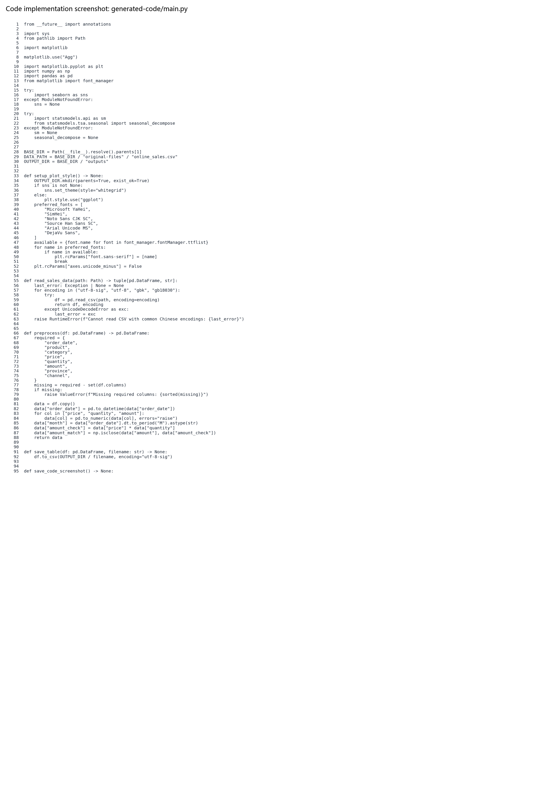
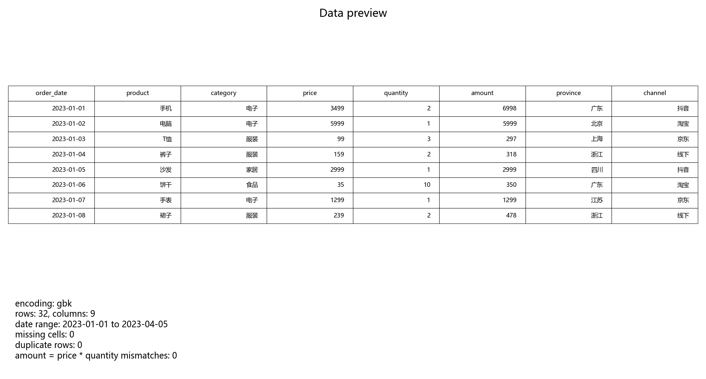
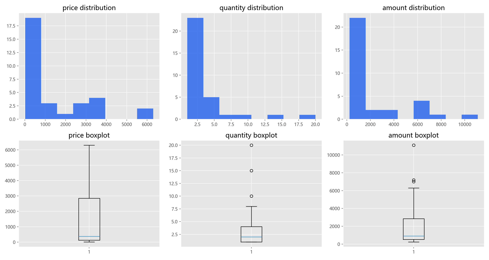
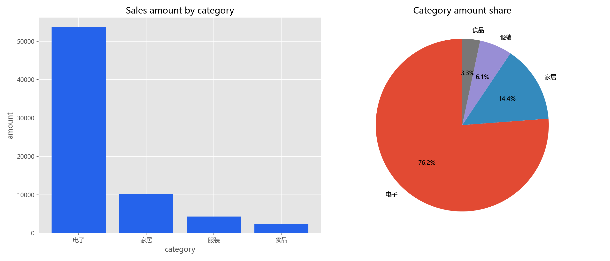
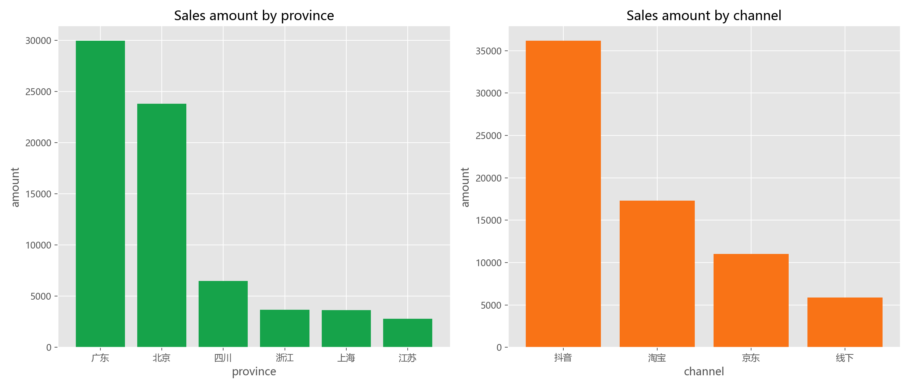
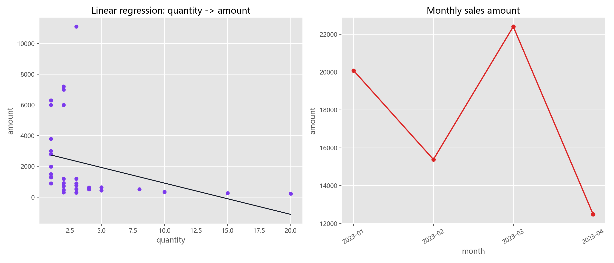
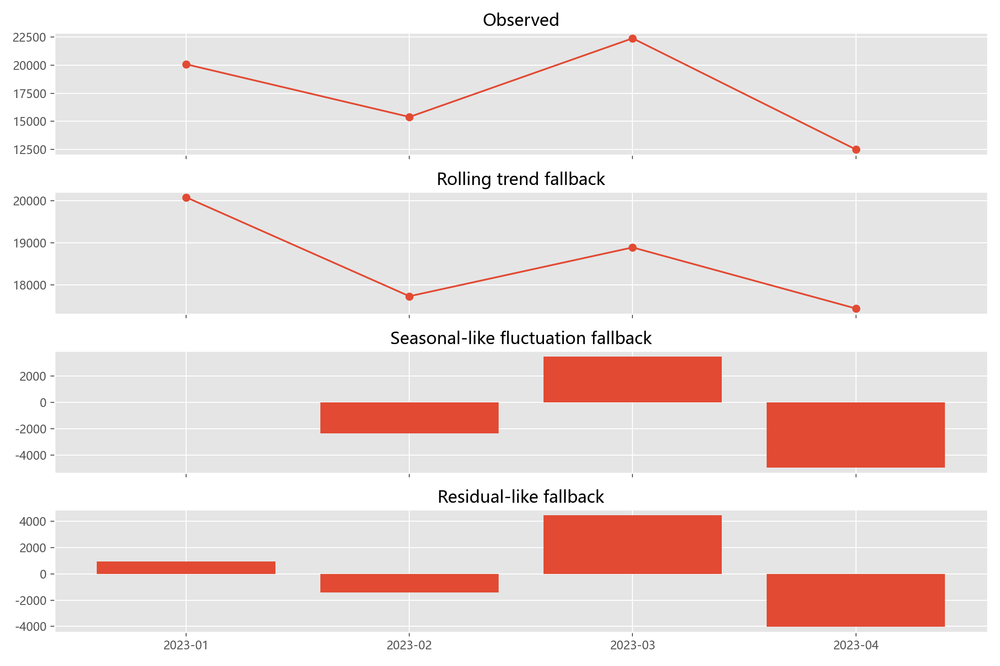

# Final Report

## 一、实验基本信息

实验名称：电商销售数据综合分析（8 大方法实战）

实验数据：`online_sales.csv`

实验环境：Python 3.x

实际运行说明：本次代码已真实运行。当前默认 Python 环境缺少 `seaborn` 和 `statsmodels`，因此代码在保留优先使用逻辑的同时，自动 fallback 到 `matplotlib` 和 `numpy` 完成绘图、回归和趋势预测。

## 二、实验目的

1. 掌握 CSV 数据读取、编码识别、日期转换和基础数据质量检查。
2. 使用描述性分析、分组分析、结构分析、分布分析、对比分析、简单线性回归、预测分析和时间序列分析处理电商销售数据。
3. 通过图表展示销售结构、渠道表现、地区差异和月度变化。
4. 基于真实 stdout 和图表结果形成分析结论。

## 三、实验代码与运行

代码文件：`generated-code/main.py`

运行命令：

```powershell
$env:PYTHONIOENCODING='utf-8'
python docs\agent-samples\001-ecommerce-sales-analysis\generated-code\main.py
```

代码实现截图：



## 四、实施过程与结果分析

### 1. 数据读取与预处理

代码自动尝试 `utf-8-sig`、`utf-8`、`gbk`、`gb18030` 编码，最终使用 `gbk` 成功读取 CSV。数据共有 32 条记录，原始字段包括 `order_date`、`product`、`category`、`price`、`quantity`、`amount`、`province`、`channel`。

数据日期范围为 2023-01-01 至 2023-04-05。缺失单元格为 0，重复行数为 0，且所有记录均满足 `amount = price * quantity`，说明该数据集质量较好，可以直接进入后续分析。



### 2. 描述性分析与分布分析

真实运行结果显示，总销售额为 70,351.00 元，总销量为 118 件，平均订单金额为 2,198.47 元，中位数为 898.00 元。销售额均值明显高于中位数，说明数据中存在高客单价订单拉高均值的现象。

主要描述性统计如下：

- 单价均值：1,412.53，标准差：1,804.26。
- 销量均值：3.69，标准差：4.20。
- 销售额均值：2,198.47，标准差：2,719.78。
- 单笔销售额最大值：11,097.00。



### 3. 分组分析与结构分析

按商品品类统计，电子类销售额最高，为 53,601 元，占总销售额 76.19%；家居类销售额为 10,136 元，占比 14.41%；服装和食品占比分别为 6.08% 和 3.32%。这说明该数据集中的销售额主要由高价电子产品贡献。



### 4. 地区与渠道对比分析

按省份统计，广东销售额最高，为 29,952 元，占比 42.58%；北京销售额为 23,809 元，占比 33.84%。从渠道看，抖音销售额最高，为 36,168 元，占比 51.41%；淘宝销售额为 17,297 元，占比 24.59%。

渠道结果说明，抖音在本数据集中贡献了最高销售额；淘宝销量较高，但由于部分商品单价较低，销售额占比没有抖音高。



### 5. 简单线性回归与月度趋势

以销量为自变量、销售额为因变量建立简单线性回归。真实运行输出的回归方程为：

```text
amount = 2947.99 + (-203.26) * quantity; R^2=0.0985; p=nan
```

该结果显示，在本小样本中，销量与销售额之间不是简单正相关。原因是高销量订单多来自低价食品，而高销售额订单多来自低销量高单价电子商品。因此，单独用销量预测销售额并不可靠，模型解释力较弱。

月度销售额如下：

- 2023-01：20,082
- 2023-02：15,384
- 2023-03：22,401
- 2023-04：12,484



### 6. 时间序列分解与预测

由于数据只有 4 个月，严格的季节性分析证据不足。本次代码在缺少 `statsmodels` 时使用滚动均值作为趋势 fallback，并生成教学用途的分解图。

简单线性趋势预测得到：

- 未来第 1 个月预测销售额：13,643.50
- 未来第 2 个月预测销售额：12,065.80

这类预测只能作为演示，不能作为稳定业务预测依据。若要提升可靠性，需要更长时间跨度的数据，并补充促销、节假日、折扣、用户画像等变量。



## 五、问题及思考

1. 本次实验首先遇到的是环境依赖问题。原始任务要求 `seaborn` 和 `statsmodels`，但当前默认 Python 环境没有安装。第一次运行失败后，代码改为优先使用这些库、不可用时自动 fallback，从而保证实验可以真实运行并保留失败与修复记录。
2. CSV 文件实际使用 GBK 编码。如果只按 UTF-8 读取会失败或产生乱码，因此中文数据分析任务中需要先做编码识别。
3. 回归分析结果提醒我，统计模型不能脱离业务背景解释。销量高不一定销售额高，因为低价商品可以带来高销量，而高价电子商品即使销量低，也可能贡献主要销售额。
4. 时间序列数据只有 4 个月，样本量不足以支撑稳定季节性结论。未来如果要接入网站自动化，应在报告生成阶段自动提示“时间序列样本不足”的限制。

## 六、结论

本次实验完成了电商销售数据读取、清洗、描述性统计、分组分析、结构分析、分布分析、对比分析、线性回归和时间序列趋势分析。真实运行结果表明，数据集中电子类商品贡献了主要销售额，广东和北京是主要销售地区，抖音是销售额最高渠道。回归模型解释力较弱，说明单独依赖销量预测销售额不可靠，需要结合商品价格和品类结构进行解释。
